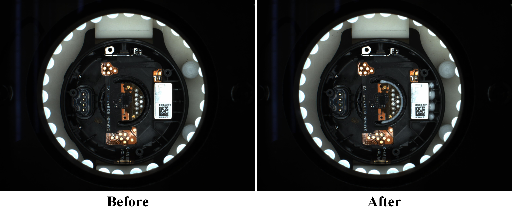
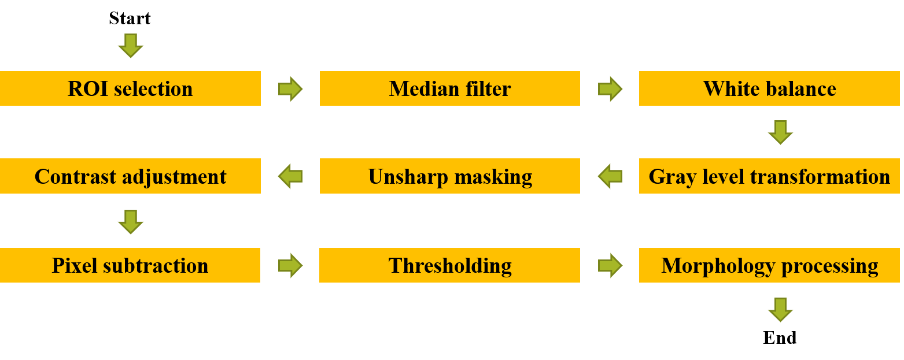
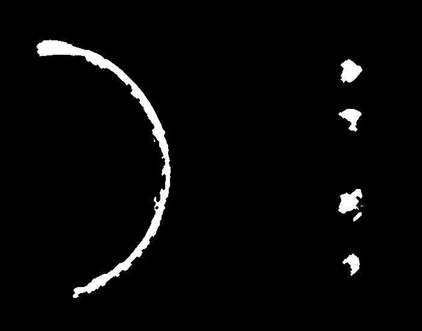
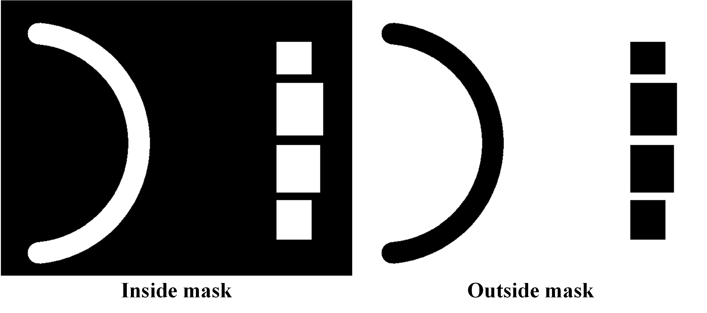
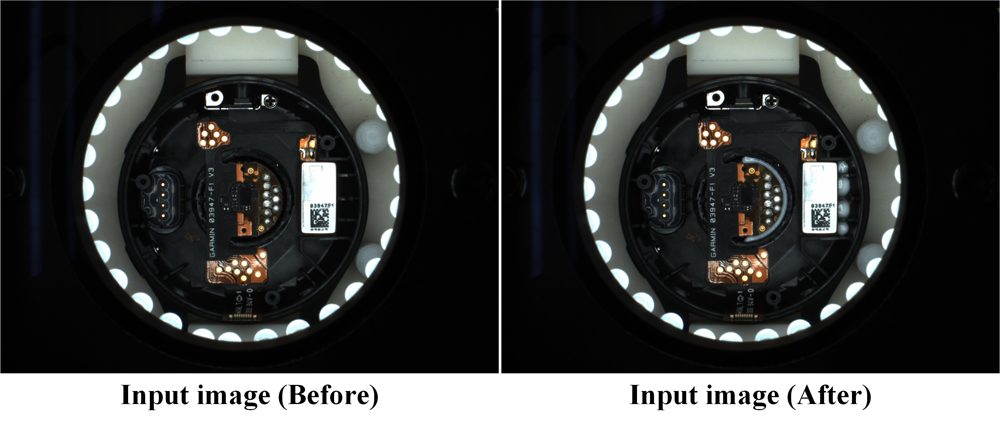
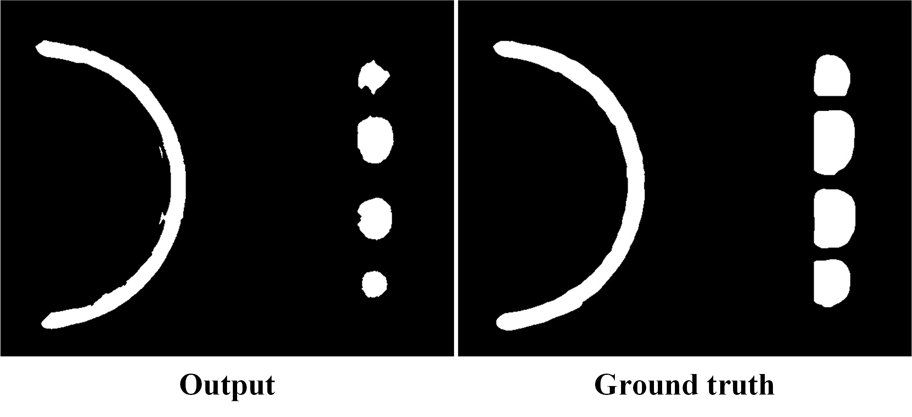
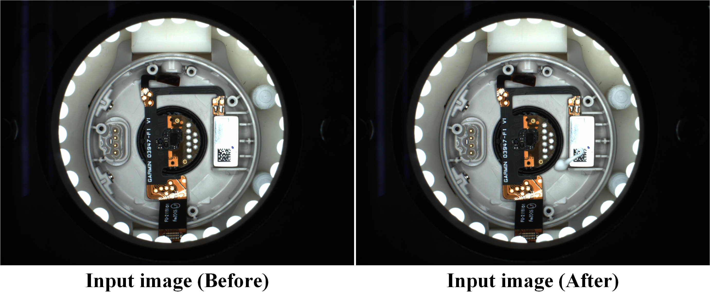
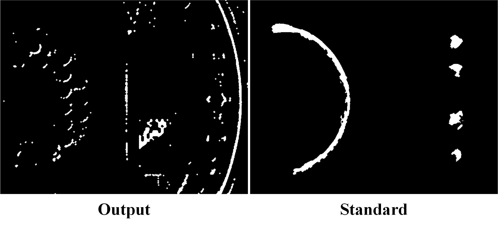

# AOI defects detection

This repository implements an AOI defect detection method for inspecting the dispensing quality of automated dispensing robots. The dispensing place is roughly the range of the red line in the figure shown below. If there is less dispense within the range or much dispense beyond the range, it is considered a bad result and needs to be identified.

<div align="center">

</div>

## Table of Contents

- [Prerequisites](#prerequisites)
- [Dataset](#dataset)
- [Usage](#usage)
- [Workflow](#workflow)
  - [Image processing](#image-processing)
  - [Training](#training)
  - [Test](#test)
- [Experiment Results](#experiment-results)
  - [IoU metric evaluation](#iou-metric-evaluation)
  - [Bad sample recognition](#bad-sample-recognition)
- [License](#license)

## Prerequisites

- Microsoft Visual C++ 2019 
- CMake 3.18.3
- OpenCV 3.4.12

## Dataset

The dataset is divided into good samples and bad samples according to the dispensing quality. There are 7 samples in `sample_good/` and 25 samples in `sample_bad/` respectively. Also, the labeled images of the good samples are within `sample_good_Groundtruth/` for labeling the dispensing place. Sample images and file paths are shown below.

<div align="center">

</div>

```
defects-detection/
            ├── sample_good/
            |         ├── 1_before.jpg
            |         ├── 1_after.jpg
            |         └── ...
            ├── sample_good_Groundtruth/
            |         ├── 1_correct.jpg
            |         └── ...
            └── sample_bad/
                      ├── 1b_before.jpg
                      ├── 1b_after.jpg
                      └── ...
```

## Usage

```bash
git clone https://github.com/ChienHsuan/AOI-defects-detection.git
cd AOI-defects-detection
```

Generate a project buildsystem with CMake.

```bash
cmake -S . -B ./build -G "Visual Studio 16 2019" -T host=x64 -A x64
```

Build the project.

```bash
cmake --build ./build --config Release --target AOI-defects-detection -j 10
```

Run the program.

```bash
build/Release/AOI-defects-detection.exe
```

## Workflow

The input images include a image before dispensing and a image after dispensing, which will first go through multiple image processing steps to mark the dispensing place. During the training stage, common features are collected from the dispensing place of all good samples. In the test stage, the bad samples are identified according to the common features of the good samples.

### Image processing

The image processing steps are sequentially described below. ***ROI selection*** select the image area to be processed. ***Median filter*** remove the noise from input images. ***White balance*** balance and adjust the color temperature in the images. ***Gray level transformation*** convert the color images to the gray level images. [***Unsharp masking***](https://inis.iaea.org/collection/NCLCollectionStore/_Public/43/052/43052920.pdf) and ***Contrast adjustment*** increase the contrast of the object edges and colors in the images. ***Pixel subtraction*** subtract the pixel values of the two images (before and after dispensing). ***Thresholding*** and ***Morphology processing*** remove the noise points generated after the subtraction of the two images, and then obtain the output image.

<div align="center">

</div>

### Training

During the training stage, only use good samples for training. Mark the dispensing place through [Image processing](#image-processing), and record the common dispensing place from all good samples, as shown in the figure below.

<div align="center">

</div>

Filter the common dispensing place through the designed masks to calculate the area of the inside mask and the area of the outside mask. The mask images are shown below.

<div align="center">

</div>

### Test

+ The degree of overlap between the output image of each good sample and the ground truth is evaluated by the IoU metric, which is used to represent the proportion of dispensing place that can be extracted from the input images.

+ Take the bad sample as input sample, and use the common dispensing place of the good samples obtained in training stage to evaluate the inside mask error and outside mask error of the input sample. If the total error is greater than or equal to 10% of the total area of the common dispensing place, it is judged as a bad sample, and the recognition accuracy is also calculated for all bad samples.

## Experiment Results
### IoU metric evaluation

The following are the results of IoU metric evaluation and output images for good samples.

| samples | avg. IoU | avg. cost time (sec.) |
| :---: | :---: | :---: |
| good sample 1 ~ 7 | 0.7072 | 0.0247 |

<div align="center">

</div>

<div align="center">

</div>

### Bad sample recognition

The following are the results of recognition accuracy evaluation and output images for bad samples.

| samples | accuracy | avg. cost time (sec.) |
| :---: | :---: | :---: |
| bad sample 1 ~ 25 | 100% | 0.0257 |

<div align="center">

</div>

<div align="center">

</div>

## License

The MIT License (MIT)  
Copyright (c) 2022 Chien-Hsuan Yen
